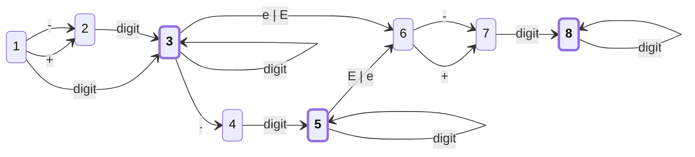

# An invitation to the theory of parsing
Here we will show you how to build a simple parser. With this pretense we will learn about algorithms, lexers, parsers and a little bit of Rust.

## Introduction. The theory of parsing

At [EqualTo](https://wwww.equalto.com) we built a spreadsheet engine from scratch in the Rust programming language. We can compile it to WebAssembly and run in in the [web](https://www.equalto.com/suresheet) or compile it to machine code and run it headless. The first step in writing such an engine would be to write an Excel formula parser. Since writing a full fledged Excel formula parser is a daunting task we will split it in two articles. In this first installment today we will show you how to build a parser, an interpreter and a compiler(!) for a desk calculator.

This will be a bird's eye introduction to the theory of parsing for an accidental tourist.

Parsing serves as the front end of a compiler and it is considered a solved problem today. Its primary purpose is to transform a human readable string into an object, the abstract syntax tree, that a computer can understand and handle.

If you are creating a new programming language or even a new mini language for your application you will need to create a parser for your language.

In general, there are two main approaches to solving this problem: you can either use a parser generator (also known as a compiler compiler) or write one by hand. Times have been changing, and while 30 years ago most people would prefer to use a compiler compiler for their languages, today most folks would use a handmade parser.

Parsers generated by a computer typically follow a bottom-up, non-recursive algorithm. They usually run in linear time and linear space, and are table-driven. The classic example is [Bison](https://en.wikipedia.org/wiki/GNU_Bison). There are many others, such as the famous [ANTLR](https://www.antlr.org/), which actually uses a top-down recursive algorithm. With these tools, you only need to write the grammar for your language or DSL (Domain Specific Language), and they will provide you with the code for the parser.

There are some disadvantages to parser generators. First, they introduce a dependency in your code. Since the generated code may not conform to your coding standards, you will likely need to treat it as an external dependency and include an extra build step in your system. This can make things difficult when you upgrade, as the tool might lag behind. Additionally, you may have to wrestle with the grammar quite a bit before making it compatible with your tool, which usually involves rewriting certain rules until everything works correctly.

Handwritten parsers also have their drawbacks, as it's easy to write a slow parser, and they can be error-prone. Errors are more likely to occur in your code than in your grammar, although you can mitigate this with thorough testing. On the other hand, it is easier to handle unusual corner cases in your language with a handwritten parser, which offers greater flexibility. Moreover, error reporting and recovery are much simpler with handwritten parsers.

In general, if you are writing a small language, I prefer a hand-generated parser. However, if you are working with a complex language, have time constraints, and have multiple contributors to the project, a generated parser might be a better option. These days, if I use a generated parser, I start with a Bison parser generator in my language of choice until I convince myself that a [PEG](https://en.wikipedia.org/wiki/Parsing_expression_grammar) parser is a better idea.

There is one thing about the handwritten parsers: they are a lot of fun.

In the first section we will build a calculator using a Pratt parser.

There is a fair amount of theory involved, so if some aspects are unclear upon first reading, continue reading and return to those parts later for clarification.

## A desk calculator

> What I cannot create, I do not understand
>
> Richard Feynman

In their now almost 40 year old book [The Unix Programming Environment](https://en.wikipedia.org/wiki/The_Unix_Programming_Environment) Brian Kernighan and Rob Pike urge us to build a desk calculator. They used the standard techniques at the time, a parser generator _yacc_ (now you would probably use bison) and _lex_ (today you could use flex).

We are going to follow their footsteps by doing the calculator manually.
You can find all the code for this example in our [GitHub repository](https://github.com/EqualTo-Software/calculator).

### The one with the REPL

First thing we need is a _REPL_ (Read-Eval-Print-Loop). Go ahead create a new Rust project with `cargo new calculator` and substitute the `main.rs` file with:

```rust
use std::io::{stdin, stdout, Write};

fn evaluate(input: &str) -> String {
    input.to_string()
}

fn main() {
    loop {
        let mut input = String::new();
        print!("Input: ");
        let _ = stdout().flush();
        stdin()
            .read_line(&mut input)
            .expect("Failed reading command");
        input = input.trim().to_string();

        if input == ".exit" {
            println!("Bye!");
            break;
        }

        let output = evaluate(&input);
        println!("Output: {}", output);
    }
}
```

That is an echo REPL, it basically writes back whatever you said. You can run your program with `cargo run`. If you type `.exit` you exit the program (I stole that one from nodejs, yes that is how you exit a nodejs REPL).

### The one with the grammar

We are going to split the evaluate function in two parts, parsing the formula into an _[abstract syntax tree](https://en.wikipedia.org/wiki/Abstract_syntax_tree)_ (or AST for short) and traversing the tree while doing the evaluation. The second part is the job of an _interpreter_.

When writing a parser the first thing you need to do is to spell out the grammar for your language:

```
expression    => primary operator expression | primary
primary       => Number | Variable_name | '(' expression ')' | function_call
function_call => Function_name '(' expr ')'
operator      => '+' | '-' | '*' | '/'
```

These are the blueprints of the program we are going to write. There are formal, very theoretical specifications of what a grammar is, but we will be a bit loose here. To give you an idea, parser generators are able to generate a whole program just from that grammar.

### The one with the lexer

The second step after having the grammar at hand is probably writing the data structures. In this regard Rust is a very convenient language because it has _[algebraic data types](https://en.wikipedia.org/wiki/Algebraic_data_type)_ and _enum varieties_.

The list of tokens will be an _enum_:

```rust
// Tokens
enum Token {
    Number(f64),
    Name(String),
    OpenParenthesis,
    CloseParenthesis,
    Plus,
    Minus,
    Times,
    Divide,
}
```

The lexer, scanner or tokenizer, your pick, will get a string like "`2.3+4*(Sin(3+7)+5)^2`" and return one by one its components or _tokens_.

For this particular formula it will be:

```
[
    Number(2.3),
    Plus,
    Number(4.0),
    Times,
    OpenParenthesis,
    Name("Sin"),
    OpenParenthesis,
    Number(3.0),
    Plus,
    Number(7.0),
    CloseParenthesis,
    Plus,
    Number(5.0),
    Power, 
    Number(2.0)
]
```

It is important to note that for some programming languages, it may not always be possible to split an input into tokens like this. The Fortran programming language is notorious for this issue due to its insignificant white spaces. However, in most modern languages and for the formulas we will analyze here, it is possible to divide a formula into individual components called tokens. 

The algorithm that performs this task is a Deterministic Finite Automaton (DFA). Essentially, if your tokens can be described by Regular Expressions (RE), they can be converted to a DFA and easily implemented in a computer. This is a [theorem](https://en.wikipedia.org/wiki/Thompson%27s_construction) in computer science. In this article, we will not delve into the theorem itself; instead, we will focus on how we can apply it to our specific example.

A lexer will be something like:

```rust
pub struct Lexer {
    input_chars: Vec<char>,
    position: usize,
}

impl Lexer {
    pub fn new(input_text: &str) -> Lexer {
        let input_chars: Vec<char> = input_text.chars().collect();
        Lexer {
            input_chars,
            position: 0,
        }
    }

    pub fn next_token(&mut self) -> Token {
        self.consume_whitespace();
        match self.read_next_char() {
            Some(ch) => match ch {
                '+' => Token::Plus,
                '-' => Token::Minus,
                '*' => Token::Times,
                '/' => Token::Divide,
                '^' => Token::Power,
                '(' => Token::OpenParenthesis,
                ')' => Token::CloseParenthesis,
                '0'..='9' | '.' => {
                    self.position -= 1;
                    self.read_number()
                }
                'A'..='Z' => self.read_function(ch),
                _ => Token::Illegal(format!("Unexpected character: {}", ch)),
            },
            None => Token::EoI,
        }
    }

    fn read_next_char(&mut self) -> Option<char> {
        let next_char = self.input_chars.get(self.position);
        if next_char.is_some() {
            self.position += 1;
        }
        next_char
    }

    fn peek_char(&self) -> Option<char> {
        self.input_chars.get(self.position)
    }

    fn consume_whitespace(&mut self) {
        while Some(char) = self.input_chars.get(self.position) {
            if !char.is_whitespace() {
                break;
            }
            self.position += 1;
        }
    }

    fn read_function_name(&mut self, first_letter: char) -> Token {
        todo!()
    }

    fn read_number(&mut self) -> Token {
        todo!()
    }
}

```

Let's go over it. First observe the Lexer definition:

```rust
pub struct Lexer {
    input_chars: Vec<char>,
    position: usize,
}
```

If we were to make the same structure in TypeScript, Python, Kotlin,.. we would have but one option:

```kotlin
class Lexer(
    val input: String,
    var position: UInt,
) { /*...*/ }
```

But in Rust we have a plethora of options. Do we want the types to be owned by the Lexer or is the data shared? The first option is easier but implies that the Lexer will make a copy of the data and do memory allocations on the heap. The second is a bit more complex because it involves lifetimes but it's faster and more memory efficient.
But troubles do not end there. You might want to use a _[smart pointer](https://doc.rust-lang.org/book/ch15-00-smart-pointers.html)_, you can use `Box<Node>` if you just want to store the pointer in the stack. We will use that when we discuss the parser. The _abstract syntax tree_ is an acyclic graph, but if we were to deal with a cyclic graph we would need to use another smart pointer `Rc<Node>` (if you are coming from Swift or Objective-C you will find this smart pointer familiar). For example if we were to create a data structure to keep track of cell dependencies in a spreadsheet we would use `Rc` because two different cells can depend on the same cell.

Second, notice how we convert the `String` to a vector of `char`. This is to make our lives easier with utf8 encode unicode characters. In the standard library `String` is just a vector of bytes. We cannot just access the n-th character easily. 

For our simple lexer we could have instead:

```rust
pub struct Lexer<'a> {
    formula: &'a str,
    position: usize,
}
```

In fact, we will revisit this topic when discussing the more sophisticated lexer for spreadsheet formulas in a future article. Most of the code in the lexer should be relatively straightforward to read, with the possible exception of the number recognizer.

To be honest, this is a challenging problem. As recently as November 2022, [Daniel Lemire](https://lemire.me/en/) demonstrated that it is possible to [parse numbers at gigabytes per second](https://lemire.me/blog/2021/01/29/number-parsing-at-a-gigabyte-per-second/). Parsing numbers consists of two parts: first, _recognizing_ the number by identifying the integer part, decimal part, and exponent; and second, finding the closest floating-point number to the real number we recognized. The latter is the more difficult aspect. The inverse problem of finding the most visually appealing way to display a given floating-point number on screen currently relies on the [Ryū algorithm](https://github.com/ulfjack/ryu) by [Ulf Adams](https://www.youtube.com/watch?v=kw-U6smcLzk&ab_channel=PLDI2018), which is one of my favorite _modern_ algorithms.

Still recognizing the number will take us a bit of effort but you will learn in general how to go from a RE to code.

A RE for a number might be:

```
/^[+-]?[0-9]+(.[0-9]+)?([Ee][+-][0-9]+)?$/
```

Consider this diagram (_accepting states_ are 3, 5 and 8):
```
                         digit                       digit                                     digit
    +-----+-----+       +------+                   +-----+              +-----+-----+         +-----+
    |     +     |       |      |                   |     |              |     +     |         |     |
    |           |       |      |                   |     v              |           v         |     v
 +--+--+     +--+--+    |   +--+--+     +-----+    |  +--+--+       +---+-+      +--+--+      |  +--+--+
 |  1  |     |  2  |    +---+  3  |  .  |  4  |    +--+  5  |       |  6  |      |  7  |      +--+  8  |
 |     |     |     +------->+     +-----+     +-------+     +------>+     |      |     +-------->+     |
 ++-+--+     +--+--+ digit  +-+-+-+     +-----+ digit +-----+ E | e +-+-+-+      +--+--+  digit  +-----+
  | |           ^             | |                                     ^ |           ^
  | |     -     |             | |                                     | |     -     |
  | +-----+-----+             | |                                     | +-----+-----+
  |                           | |                                     |
  |         digit             | |              E | e                  |
  +---------------------------+ +-------------------------------------+
    
```



Our number recognizer, a _finite automata_, has 8 states. an accepting state is an state in which you can finish your parsing. Once you have drawn the diagram is really easy to put it into code:

```rust
    fn read_number(&mut self) -> Token {
        let mut state = State1;
        let mut str = "".to_string();
        let mut accept = true;
        while accept {
            if let Some(&c) = self.peek_char() {
                match state {
                    State1 => {
                        if c.is_ascii_digit() {
                            state = State3;
                        } else if c == '-' || c == '+' {
                            state = State2;
                        } else {
                            return Token::Illegal(format!("Expecting digit or + or -, got {}", c));
                        }
                    }
                    State2 => {
                        if c.is_ascii_digit() {
                            state = State3;
                        } else {
                            return Token::Illegal(format!("Expecting digit got  {}", c));
                        }
                    }
                    State3 => {
                        // Accepting state
                        if c == '.' {
                            state = State4;
                        } else if c == 'E' || c == 'e' {
                            state = State6;
                        } else if !c.is_ascii_digit() {
                            accept = false;
                        }
                    }
                    State4 => {
                        if c.is_ascii_digit() {
                            state = State5;
                        } else {
                            return Token::Illegal(format!("Expecting digit got  {}", c));
                        }
                    }
                    State5 => {
                        // Accepting state
                        if c == 'e' || c == 'E' {
                            state = State6;
                        } else if !c.is_ascii_digit() {
                            accept = false;
                        }
                    }
                    State6 => {
                        if c == '+' || c == '-' || c.is_ascii_digit() {
                            state = State7;
                        } else {
                            return Token::Illegal(format!("Expecting '+'or '-' got  {}", c));
                        }
                    }
                    State7 => {
                        if c.is_ascii_digit() {
                            state = State8;
                        } else {
                            return Token::Illegal(format!("Expecting digit got  {}", c));
                        }
                    }
                    State8 => {
                        // Accepting state
                        if !c.is_ascii_digit() {
                            accept = false;
                        }
                    }
                }
                if accept {
                    str.push(c);
                    self.position += 1;

                }
            } else {
                break;
            }
        }
        Token::Number(str.parse::<f64>().unwrap())
    }
```

### The one with the parser
> To iterate is human, to recurse divine.
>
> Peter Deutsch

Once we have a machine able to recognize tokens we are ready to build the AST. We will use a top down recursive parser.
The data structure is something like:


```rust
// Abstract syntax tree nodes
enum Node {
    Operation {
        op: Operation,
        left: Box<None>,
        right: Box<Node>,
    },
    Function {
        fun: Function,
        arg: Box<Node>
    }
    Number(f64),
    Variable(String)
}

enum Function {
    Sin,
    Cos,
    Tan,
    Ln,
    Exp,
}

enum Operator {
    Plus,
    Minus,
    Times,
    Divide, 
}
```

Note that in Rust we use a smart pointer (the `Box`) to link to the next node in a tree structure/

Although we are building a simple calculator we are actually going to face what is possible the most difficult problem in parsing: left recursion and precedence.
The correct tree for the formula `3+4*8` is:
```
     +
    / \
   3   *
      / \
     4   8
```
And not
```
     *
    / \
   +   8
  / \
 3   4
```
That would be `(3+4)*8`. That is `*` has precedence over `+`. The traditional way of doing this is adapting the grammar in a way that reflects the precedence rules. We will do a different thing here that is smarter but a bit more involved. It's called top down precedence parser created by [Vaughan Pratt](https://tdop.github.io/) and popularized in his build of jslint by [Douglas Crockfort](https://crockford.com/javascript/tdop/tdop.html) and [Bob Nystrom](https://journal.stuffwithstuff.com/2011/03/19/pratt-parsers-expression-parsing-made-easy/) of [Game programming patterns](http://gameprogrammingpatterns.com/) and [Crafting interpreters](http://craftinginterpreters.com/) fame, and must be one of the most beautiful recursive parsing algorithms ever written.

Here we follow [Alex Kladov](https://matklad.github.io/2020/04/13/simple-but-powerful-pratt-parsing.html).

The central idea is to attach some _binding powers_ to each operator. `*` will have a higher binding power than `+`, for instance. 

The basic implementation of a top down recursive Pratt parser will look something like this:

```rust
pub struct Parser {
    lexer: Lexer,
}

fn infix_binding_power(op: &Operator) -> u8 {
    match op {
        Operator::Plus => 1
        Operator::Minus => 1
        Operator::Times => 3
        Operator::Divide => 3
        Operator::Power => 5,
    }
}

impl Parser {
    pub fn parse(input_text: &str) -> Result<Node, ParserError> {
        let mut lexer = Lexer::new(input_text);
        let mut parser = Parser {
            lexer,
        };
        parser.parse_expression(0)
    }

    fn parse_expression(&mut self, left_bp: u8) -> Result<Node, ParserError> {
        let mut lhs = self.parse_primary()?;
        loop {
            let op = match &self.next_token {
                Token::EoI => break,
                Token::CloseParenthesis => break,
                Token::Plus => Operator::Plus,
                Token::Minus => Operator::Minus,
                Token::Times => Operator::Times,
                Token::Divide => Operator::Divide,
                Token::Power => Operator::Power,
                unexpected => todo!()
            };

            let right_bp = binding_power(&op);
            if right_bp < left_bp {
                break;
            }

            let rhs = self.parse_expression(right_bp)?;

            lhs = Node::BinaryOp {
                op,
                left: Box::new(lhs),
                right: Box::new(rhs),
            };
        }
        Ok(lhs)
    }

    fn parse_primary(&mut self) -> Result<Node, ParserError> {
        match self.lexer.next_token() {
            Token::Number(value) => {
                Ok(Node::Number(value))
            }
            Token::Plus => {
                let primary = self.parse_primary()?;
                Ok(Node::UnaryOp {
                    op: UnaryOperator::Plus,
                    right: Box::new(primary),
                })
            }
            Token::Minus => {
                let primary = self.parse_primary()?;
                Ok(Node::UnaryOp {
                    op: UnaryOperator::Minus,
                    right: Box::new(primary),
                })
            }
            Token::Name(name) => {
                if self.lexer.next_token() != Token::OpenParenthesis {
                    return Ok(Node::Variable(name));
                }
                let argument = self.parse_expression(0)?;

                self.expect(Token::CloseParenthesis)?;

                let index = match name.as_str() {
                    "Cos" => Function::Cos,
                    "Sin" => Function::Sin,
                    "Tan" => Function::Tan,
                    "Log" => Function::Log,
                    "Exp" => Function::Exp,
                    _ => {
                        return Err(ParserError {
                            position: self.lexer.get_position(),
                            message: format!("Invalid function name: '{}'", name),
                        });
                    }
                };
                Ok(Node::Function {
                    index,
                    arg: Box::new(argument),
                })
            }
            Token::OpenParenthesis => {
                let primary = self.parse_expression(0)?;
                self.expect(Token::CloseParenthesis)?;
                Ok(primary)
            }
            Token::CloseParenthesis | Token::Times | Token::Divide => Err(ParserError {
                position: self.lexer.get_position(),
                message: format!("Unexpected token: '{value}'"),
            }),
        }
    }
}
```

You probably will remember from your school days that every recursive algorithm has an equivalent iterative algorithm. In this particular case the iterative algorithm is called _[shunting yard algorithm](https://en.wikipedia.org/wiki/Shunting_yard_algorithm)_ and was invented by Edsger Dijkstra 1961 for the Algol programming language.

The first part, the `parse_expression` part is the top down precedence parser, the `parse_primary` is just a standard top down recursive parser that mimics the grammar that we repeat here because it is that important:

```
expression    => primary operator expression | primary
primary       => number | variable_name | '(' expression ')' | function_call
function_call => function_name '(' expr ')'
operator      => '+' | '-' | '*' | '/'
```

Note that the most difficult part is to tell apart a function call from a variable name. The way to do that is to realize that a function call must have a `(` after the name.
This sort of things is what is relatively easier todo by hand but it takes some effort to bend the grammar to your needs.

When we are parsing a primary expression tokens like `*` or `/` at the beginning will result in an error. No valid formula starts with `*` or `)`.

### The one with the walking interpreter

Although it is away from our core business for today no calculator would be complete without an evaluation. This is the soul of a tree walking interpreter.

Once we have a AST doing an evaluation is very straightforward:

```rust
pub fn evaluate(input: &str) -> Result<f64, ParserError> {
    let node = Parser::parse(input)?;
    evaluate_node(&node)
}

pub fn evaluate_node(node: &Node) -> Result<f64, ParserError> {
    match node {
        Node::Number(f) => Ok(*f),
        Node::Variable(s) => {
            if s == "PI" {
                Ok(std::f64::consts::PI)
            } else {
                Err(ParserError {
                    position: 0,
                    message: format!("Unknown constant: {s}"),
                })
            }
        }
        Node::Function { index, arg } => {
            let argument = evaluate_node(arg)?;
            match index {
                Function::Cos => Ok(argument.cos()),
                Function::Sin => Ok(argument.sin()),
                Function::Tan => Ok(argument.tan()),
                Function::Log => Ok(argument.ln()),
                Function::Exp => Ok(argument.exp()),
            }
        }
        Node::BinaryOp { op, left, right } => {
            let lhs = evaluate_node(left)?;
            let rhs = evaluate_node(right)?;
            match op {
                Operator::Plus => Ok(lhs + rhs),
                Operator::Minus => Ok(lhs - rhs),
                Operator::Times => Ok(lhs * rhs),
                // Missing error handling
                Operator::Divide => Ok(lhs / rhs),
                Operator::Power => lhs.powf(rhs),
            }
        }
        Node::UnaryOp { op, right } => match op {
            UnaryOperator::Plus => Ok(evaluate_node(right)?),
            UnaryOperator::Minus => Ok(-evaluate_node(right)?),
        },
    }
}
```


### The one with the compiler

We can go the extra mile and build a full compiler from the AST. To create a compiler, we need to choose a target architecture, which is sometimes x86_64, arm64, or something else. However, compilers more often target an intermediate language.

These days, people typically target the [LLVM](https://llvm.org/) infrastructure. For a beautiful introduction, see the [Kaleidoscope example](https://llvm.org/docs/tutorial/). This approach allows you not only to compile to various targets but also to apply all sorts of advanced optimizations to your assembly code.

In this case, we will target WebAssembly, which is a different approach. Writing assembly code can be a dull task, full of obscure opcodes and tricky specifications, but there are few things more rewarding for an engineer.

In assembly language, everything is a code. For example, to call a function, we write the number `0x10` and the function's index. WebAssembly is a stack machine.

To add a number to the stack, enter `0x44` followed by a byte representation of the number. In Rust, we are fortunate to only need `number.to_le_bytes()` for this task. Here, `le` stands for [little endian](https://en.wikipedia.org/wiki/Endianness). To multiply two numbers, add them both to the stack, and then add the code `0xa2`. All the codes for every operation in WebAssembly are in the [full specification](https://webassembly.github.io/spec/core/binary/index.html).

One issue we will encounter while targeting WebAssembly is the lack of built-in functions for `sin` and other operations. We have two options to address this. We could provide our own implementation, but that would result in a significant amount of assembly-generated code. Alternatively, we can import these functions from the environment, in this case, the browser. We will choose this option here. If you are curious about the specifics, you can examine the source code. For our purposes, it means that the `sin`, `cos`, `tan`, `log`, `exp`, and `pow` functions will be indexed with 0, 1, 2, 3, 4, and 5, respectively.

The core of the algorithm is:

```rust
use crate::{
    parser::{Function, Node, ParserError, UnaryOperator},
    tokens::Operator,
};

// integers must be encoded in a variable length encoding much like utf8 for string called 'leb128'
fn encode_leb128(value: u32) -> Vec<u8> {
    todo!()
}

pub fn compile(node: &Node) -> Result<Vec<u8>, ParserError> {
    let mut result = todo!();
    let body= &mut compile_node(node)?;
    let l = body.len() as u32;
    result.append(&mut encode_leb128(l+4));
    // function count
    result.push(0x01);
    result.append(&mut encode_leb128(l+2));
    // We have no local variables
    result.push(0x00);
    result.append(body);
    // end
    result.push(0x0b);

    Ok(result)
}

pub fn compile_node(node: &Node) -> Result<Vec<u8>, ParserError> {
    match node {
        Node::Number(f) => {
            let mut result = vec![0x44];
            result.append(&mut f.to_le_bytes().to_vec());
            Ok(result)
        },
        Node::Variable(s) => {
            if s == "PI" {
                let f = std::f64::consts::PI;
                let mut result = vec![0x44];
                result.append(&mut f.to_le_bytes().to_vec());
                Ok(result)
            } else {
                Err(ParserError {
                    position: 0,
                    message: format!("Unknown constant: {s}"),
                })
            }
        }
        Node::Function { index, arg } => {
            let mut argument = compile_node(arg)?;
            let mut result = vec![];
            result.append(&mut argument);
            result.push(0x10);
            match index {
                Function::Sin => result.push(0x00),
                Function::Cos => result.push(0x01),
                Function::Tan => result.push(0x02),
                Function::Log => result.push(0x03),
                Function::Exp => result.push(0x04),
                Function::Compile => unreachable!(),
            }
            Ok(result)
        }
        Node::BinaryOp { op, left, right } => {
            let mut lhs = compile_node(left)?;
            let mut rhs = compile_node(right)?;
            let mut result = vec![];
            result.append(&mut lhs);
            result.append(&mut rhs);
            match op {
                Operator::Plus => result.push(0xa0),
                Operator::Minus => result.push(0xa1),
                Operator::Times => result.push(0xa2),
                Operator::Divide => result.push(0xa3),
                Operator::Power => {
                    result.push(0x10);
                    result.push(0x05);
                }
            };
            Ok(result)
        }
        Node::UnaryOp { op, right } => match op {
            UnaryOperator::Plus => Ok(compile_node(right)?),
            UnaryOperator::Minus => {
                // we add -1 and multiply
                let mut result = compile_node(right)?;
                result.push(0x44);
                let minus_one: f64 = -1.0;
                result.append(&mut minus_one.to_le_bytes().to_vec());
                result.push(0xa2);
                Ok(result)
            },
        },
    }
}
```

To test the compiler, run `cargo run`. At the input, enter `Compile(-2.3*Sin(9)*Exp(3.1)/(1+3.2^4.5))` or any other expression you prefer. This process will create a file called `main.wasm`. To run this, you will need a browser environment and must provide all the necessary functions. You can find these in the `index.html` file.

Simply run `python -m http.server` in the calculator folder and navigate to `http://localhost:8000` on your browser. You will find the result of the evaluation in the JavaScript console.

Although this is a really small example of a compiler, it is a full working compiler and it shouldn't be terribly difficult for you to grow from here. Traditionally compilers are built after many months of work, first doing the lexer, then the parser, ... Another approach as outlined in [An incremental approach to compiler construction](http://schemeworkshop.org/2006/11-ghuloum.pdf)

That's all from me. Now, go ahead and create things that nobody ever thought were possible.

### The one with the exercises

1. (easy) Add more functions to the calculator.
2. (medium) Add a `Sum` function with three arguments like `Sum(1, 100, n*n)` or `Sum(n*n, {n, 1, 100})` depending on your taste.
3. (medium) Add variables `a = 7.4` or `a = 4*Sin(3)` that you can use in later expressions. You will need to maintain a symbol table
4. (difficult) Add for loops and if branches and create your first mini language!
5. (difficult) Rewrite the parser using Dijkstra's shunting yard algorithm.


## General references

If you want a simple and direct account of many of the issues discussed here I cannot recommend this book enough:
* [Introduction to Compilers and Language Design](https://www3.nd.edu/~dthain/compilerbook/) by Douglas Thain

A couple of folks have written books accessible to the general public that you can almost read on some Sundays afternoons.

Thorsten Ball has written a really nice book very much in the same spirit as this post:
* [Writing an interpreter in go](https://interpreterbook.com/)

Robert Nystrom's book is freely available and is a thing of beauty:
* [Crafting interpreters](https://craftinginterpreters.com/)

Also worth mentioning:
* [Build your own Lisp](https://buildyourownlisp.com/)

A couple of more academic references:

* [Engineering a compiler](https://www.elsevier.com/books/engineering-a-compiler/cooper/978-0-12-815412-0) by Keith Cooper and Linda Torczon
* [Crafting a compiler](https://www.pearson.ch/HigherEducation/Pearson/EAN/9780136067054/Crafting-A-Compiler) by Charles N. Fischer, Ron K. Cytron and Richard J. LeBlanc  

The dragon book will always remain a classic in the subject:

* [Compilers: Principles, Techniques, and Tools](https://suif.stanford.edu/dragonbook/)

If you are up for a MOOC, I can recommend this course describing the COOL programming language by Alex Aiken
* [Compilers](https://www.edx.org/course/compilers)

Or the course by Jeffrey Ullman (one of the authors of the dragon book). This might be a bit advanced.
* [Automata theory](https://www.edx.org/course/automata-theory)

Both courses from Stanford University
